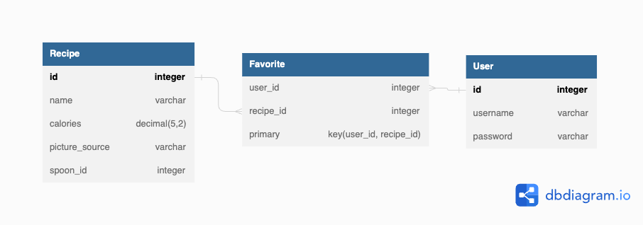

# Recepie-Box

## Description 
This is an application that allows users to search for and save their favorite recipes. Users can create an account, search for recipes by cuisine, save recipes to their dashboard, and view details about each recipe such as cooking instructions and nutritional information. The application uses a MySQL database and the Spoonacular API to access recipe information. Users can also remove recipes from their dashboard if they no longer want to see them.

## Appearance and functionality


## Example of User Story

<span style="font-family: Courier New;">
I want to be able to save my favorite recipes to my dashboard.<br/>
I can easy access them without looking them up.
</span>


This is a /api/recipe route that waits for a request to add a recipe first to the Recipe table, if it wasn't already and then to the Favorite table. 
```Javascript
//This creates a new recipe with auth user
router.post("/", withAuth, async (req, res) => {

  const recipeData = await Recipe.findOne({ where: { spoon_id: req.body.spoon_id } });

  if (!recipeData) {
    // If recipeData is not found, add the recipe to the Recipe database
    try {
      const newRecipe = await Recipe.create({
        ...req.body,
      });
      // Create a new favorite record for the user and the newly created recipe
      const newFavorite = await Favorite.create({
        user_id: req.session.user_id,
        recipe_id: newRecipe.id
      });
      // Return the newly created favorite as a JSON response with a 200 status code
      res.status(200).json(newFavorite);

    } catch (err) {
      // If an error occurs during recipe or favorite creation, return the error as a JSON response with a 400 status code
      res.status(400).json(err);
    }
  }
  else {
    // If recipeData is found, use the existing recipe
    const recipe = recipeData.get({ plain: true });
    try {
      // Create a new favorite record for the user and the existing recipe
      const newFavorite = await Favorite.create({
        user_id: req.session.user_id,
        recipe_id: recipe.id

      });
      // Return the newly created favorite as a JSON response with a 200 status code
      res.status(200).json(newFavorite);
    } catch (err) {
      // If an error occurs during favorite creation, return the error as a JSON response with a 400 status code
      res.status(400).json(err);
    }
  }

});
```

## Model Creation

Since this application only stores Users, Recipes and their many-to-many assciations, this is the picture of the data base and code snippet of one of the tables: 




```Javascript
const { Model, DataTypes } = require("sequelize");
const sequelize = require("../config/connection");


class Favorite extends Model { }

Favorite.init(
  {
    id: {
      type: DataTypes.INTEGER,
      allowNull: false,
      primaryKey: true,
      autoIncrement: true,
    },
    user_id: {
      type: DataTypes.INTEGER,
      allowNull: false,
      references: {
        model: "user",
        key: "id",
        unique: false
      },
    },
    recipe_id: { //foreign key
      type: DataTypes.INTEGER,
      allowNull: true,
      references: {
        model: 'recipe',
        key: 'id',
        unique: false
      }
    }
  },

  {
    sequelize,
    timestamps: false,
    freezeTableName: true,
    underscored: true,
    modelName: "favorite",
  }
);
```

## Third party API 


We used spoonacular APi to get disched by cuisine. 

```Javascript
const queryURL = `https://api.spoonacular.com/recipes/complexSearch?&cuisine=${cuisine}&apiKey=${API_KEY}`
```

Along with other information this request returns a ```spoon_id``` that allows you to retrieve more information using separate API rquests:

```Javascript
 const instructionsURL = `https://api.spoonacular.com/recipes/${id}/analyzedInstructions?apiKey=${API_KEY}`;
 const nutritionURL = `https://api.spoonacular.com/recipes/${id}/nutritionWidget.json?apiKey=${API_KEY}`;
 const infoURL = `https://api.spoonacular.com/recipes/${id}/information?apiKey=${API_KEY}`;
```


## CSS framework 
We primarily relied on standard CSS and flexboxes to manage various screen sizes.


## Usage 

You just need to head on over to the deployed app at [Recipe Box](https://recipesbox.herokuapp.com/). Once you Sign Up you will be able to veiw recipes and save them to your favorites Dashboard.  


## Learning Points 

Learned so much, learned to work as a team, learned better git practices, learned to communnicate in a more effective manner.  Learned to manage disagreements.  Learned how to use GreenSock to animate, learned so many different ways to test and implement code.  We all worked super hard and are our proud of the product we were able to produce.  

## Authors Info

The Curiosity Crusaders!  Turning questions into Quality Code.

* [Liubov Sobolevskaya](https://github.com/LiubovSobolevskaya)
* [Amanda Grey](https://github.com/Berkeleycodingmomma)
* [Brian Alberson](https://github.com/bdalberson)


## Credits

Many thanks to everyone who helped get us across the line for this one.  And to all the teammates for working super hard and putting the project first.    

---

## Tests
Tested the UI and user cases,  ran functional testing integratin tests to verify quality and consistency. We didn't have any time to build any unit tests but that would be a next step for future development.  

## Built With:
- JSON:[ JSON](https://www.npmjs.com/package/json)
- Dynamic JavaScript
- Node.js [Version 16.18.1](https://nodejs.org/en/blog/release/v16.18.1/)
- Express.js:[Express.js](https://expressjs.com/en/starter/installing.html)
- Bcryptjs: [2.4.3](https://www.npmjs.com/package/bcryptjs)
- Connect Session Store using Sequelize: [7.0.4](https://www.npmjs.com/package/connect-session-sequelize)
- Dotenv: [8.6.0](https://www.npmjs.com/package/dotenv)
- Express: [4.17.1](https://www.npmjs.com/package/express)
- Express Handlebars: [5.2.0](https://www.npmjs.com/package/express-handlebars)
- Express-Session: [1.17.1](https://www.npmjs.com/package/express-session)
- Handlebars.js: [4.7.6](https://www.npmjs.com/package/handlebars)
- Node MySql2: [2.3.3](https://www.npmjs.com/package/mysql2)
- Sequelize: [6.29.3](https://www.npmjs.com/package/sequelize)
- License Badge: [Shields.io](https://shields.io/)
- Visual Studio Code: [Website](https://code.visualstudio.com/)
- Heroku: [Website](https://id.heroku.com/login)
- Greensocks:  [Website](https://greensock.com/)
- Nodemon: [Website](https://www.npmjs.com/package/nodemon) 


